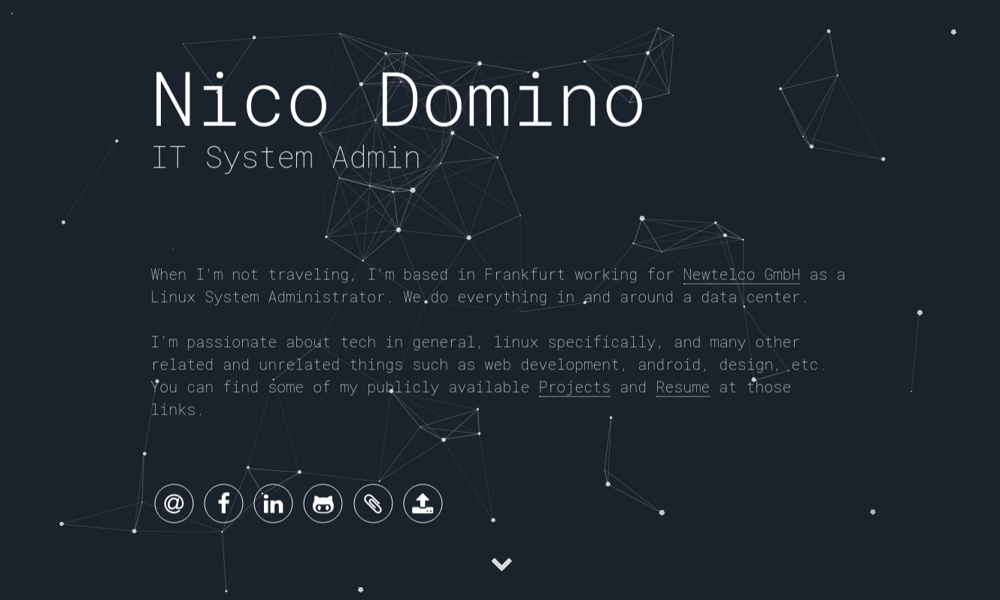

# ndom91 homepage

### Implemented Particle Jekyll Theme version by ndom91 

## Basic Setup

0. [Install Ruby](https://ruby-lang.org/en)
1. [Install Jekyll](http://jekyllrb.com)
2. Clone the [this repo](https://github.com/ndom91/ni.co.de)
3. `gem install jekyll bundler`
4. `bundle exec jekyll serve`
5. Visit `localhost:4000`

## License

This page is licensed under the MIT License. The theme is also free and open source software, distributed under the The MIT License as well. So feel free to use this Jekyll theme anyway you want.

## Credits

This theme was partially designed with the inspiration from these fine folks
- [Willian Justen](https://github.com/willianjusten/will-jekyll-template)  
- [Vincent Garreau](https://github.com/VincentGarreau/particles.js/)  
- [nrandecker](https://github.com/nrandecker/particle)

