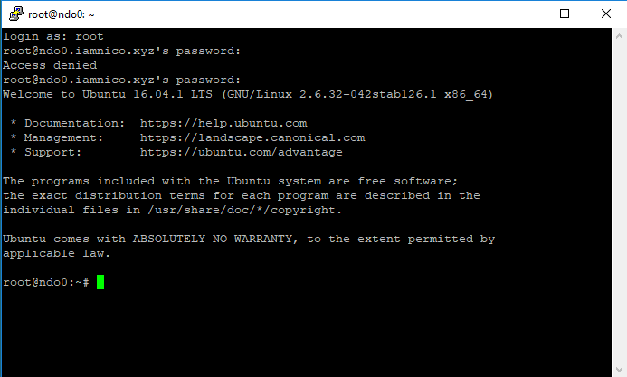

 

 
Here’s where one lands directly after the installation of a fresh linux distro. In my case Ubuntu 16.04. SSH into your machine with your favorite client [Win 32/64: [putty](https://www.putty.org/)]
<!---excerpt--->
  

 
Typing in my password wrong once or twice and logged in as root. Here goes nothing!

So the first thing I like to do is create a new user for myself and give him the correct rights.


sudo add user ndom
usermod -aG sudo ndom


Now that we’ve got that out of the way, we’re going to want to step up our security a bit. To do that we’re going to immediately enable SSH only via Key Authentication and disable password login.

So to begin, we’re going to generate a key-pair. Remember, you keep the private key well, private, and the public key gets stored on this server and any others you may wish to log into with this key with.


ssh-keygen


Next you’ll be prompted for a passphrase, I usually press enter here to leave this blank, but if you are extra paranoid or want to be extra secure – go ahead and enter a passphrase as well. Just beware you will have to enter this to login every time!

After that is complete it will tell us where the keys were saved so that we can move/use them.


Generating public/private rsa key pair.
Enter file in which to save the key (/Users/[user]/.ssh/id_rsa):


If you’ve accepted the defaults your keys will look like this:
id_rsa and id_rsa.pub (<– psst this is the public one ;))

To make life easier we can simply rename the public key "authorized_key"


sudo mv /home/[user]/.ssh/id_rsa.pub /home/[user]/.ssh/authorized_key


Just to recap, because this confused me often when I was beginning – the PUBLIC KEY stays on your server in the form of the authorized_keys file. The PRIVATE KEY leaves the server (if thats where you generated it) and never goes onto this machine again. You keep it hidden away on your client machines only to be used to setup your SSH client profiles for this server!

Anddd back to the tutorial:

In order to get the private key onto your windows machine, for example, you have a few options – you can use FTP, SCP, some sort of cloud storage ala Dropbox, etc. I like to use SCP at this point because its easy and I dont have to install anything extra.

Finally we can disable Password Authentication by editing the ssh config file


sudo nano /etc/ssh/sshd_config

PasswordAuthentication no

PubkeyAuthentication yes


While we’re in the SSH config, I also like to disable Root login via ssh. Also double check that your authorized_keys file is located in the correct spot..


PermitRootLogin no
AuthorizedKeysFile /home/[user]/.ssh/authorized_keys


And then finally we restart the ssh server and login with our new key!


sudo systemctl reload sshd


P.S. ssh-keygen on Linux generates SSH Keys in the OpenSSH format. If your going to be logging in from Putty on Windows, this will be a problem. Putty has its own format for keys and doesn’t play nice with OpenSSH.

Luckily they are nice enough to include a tool (PuttyGen) to a) generate their own SSH keys, but more importantly for us b) convert OpenSSH keys to Putty format.

I like to save two copies of each key to my super secret spot where I keep my ssh keys 😉 – one Putty, one OpenSSH.

In my experience the OpenSSH format is used most often. My preferred SSH client on Android (JuiceSSH – great app btw, go buy it!) uses them, as well as all linux based SSH clients. Actually Putty is the only application I personally have ever run into which uses that format. Why they can’t just play nicely with OpenSSH is a question for the ages I think..

To recap, we’ve added a local user for ourselves to work with and added him to the sudoers file so we can avoid using the root user (remember, use the root user as little as possible!), then we generated SSH keys and setup SSH Key Auth and disabled Password Auth. That way our SSH access is locked down as tight as possible. We can continue setting up our machine being pretty confident we’re safe in this department.

source: [digital ocean](https://www.digitalocean.com/community/tutorials/initial-server-setup-with-ubuntu-16-04)
