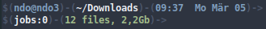

Hi All,

So I’m contemplating putting up my dotfiles to github like many others, but mine really aren’t that complex, unmanageable, or interesting yet imo.
<!---excerpt--->
So first of all, here’s my bash prompt (PS1):


PS1="\n\[\e[30;1m\]\[\016\]$\[\017\](\[\e[34;1m\]\u@\h\[\e[30;1m\])-(\[\e[37;1m\]\w\[\e[30;1m\])-(\[\e[34;1m\]\@ \d\[\e[30;1m\])->\[\e[30;1m\]\n\[\016\]$\[\017\](\[\e[37;1m\]jobs:\j\[\e[30;1m\])-(\[\e[32;1m\]\$(/bin/ls -1 | /usr/bin/wc -l | /bin/sed 's: ::g') files, \$(/bin/ls -lah | /bin/grep -m 1 total | /bin/sed 's/total //')b\[\e[30;1m\])-> \[\e[0m\]"


Nevertheless here are a few shortcuts and aliases I’ve collected that I really enjoy using:

Largest folders and sub folders:


du -Sh | sort -rh | head -5


Largest files:


find -type f -exec du -Sh {} + | sort -rh | head -n 5


other .bashrc aliases I use:


# some more ls aliases
alias ll='ls -halF --color=auto'
alias li='ls -laXh --group-directories-first --color=auto'

# if user is not root, pass all commands via sudo #
if [ $UID -ne 0 ]; then
alias reboot='sudo reboot --reboot'
alias update='sudo apt-get upgrade'
fi

## get rid of command not found ##
alias cd..='cd ..'

## a quick way to get out of current directory ##
alias ..='cd ..'
alias ...='cd ../../../'
alias ....='cd ../../../../'
alias .....='cd ../../../../'
alias .4='cd ../../../../'
alias .5='cd ../../../../..'

alias ping='ping -c 5'

alias apt-get='sudo apt-get'
alias apt-gety='sudo apt-get --yes'

alias apachereload='sudo /usr/sbin/apachectl -k graceful'
alias apachetest='sudo /usr/sbin/apachectl -t && /usr/sbin/apachectl -t -D DUMP_VHOSTS'

alias meminfo='free -m -l -t -h'
alias df='df -H --output'

alias iftop='sudo iftop -i [interface]'

alias topfolders='sudo du -hs * | sort -rh | head -5'
alias topfiles='sudo find -type f -exec du -Sh {} + | sort -rh | head -n 5'

alias emptytash='rm -rf ~/.local/share/Trash/*'


A more advanced use for .bashrc aliases I’ve found out about lately which I’ve begun implementing, is to simply roll with your typos. If you find yourself making the same typo over and over, forget correcting your mistake if you cant get a hang of it. Simply add the mistake to .bashrc and dont ever worry about it again. For example:

If you often find yourself typing sduo instead of sudo, this alias is your friend..


alias sduo='sudo'


So as you can see aliases are a great way to increase your bash proficiency.

If you have any other great aliases / .bashrc file tricks – please let me know!
