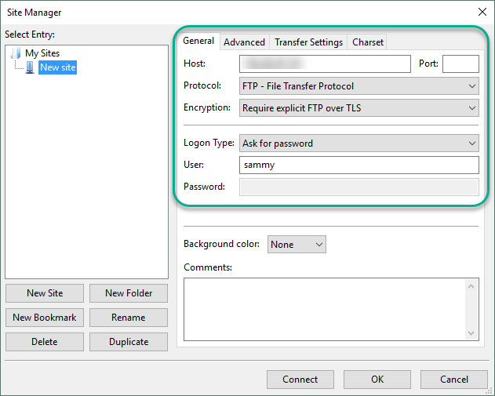

 

So an FTP server is often one of the first things people want to setup on a new server. I recently setup two, one on my Raspberry Pi for making a 2TB USB Drive available in my home, and another somewhat more secure one on my VPS to transfer files back and forth.
<!---excerpt--->
So anyway, lets just right in.

Like always..


sudo apt-get update
sudo apt-get install vsftpd


First we will we make an FTP Folder inside our users home directory that will serve as our default FTP Directory (or possibly only available directory via FTP, more on that later..)


sudo mkdir /home/[user]/ftp


And make sure no one can write to this folder


sudo chown nobody:nogroup /home/[user]/ftp


Then make a folder inside that one that we can actually write to


sudo mkdir /home/[user]/ftp/files

sudo chown [user]:[user] /home/[user]/ftp/files


Then open the config file


sudo nano /etc/vsftpd.conf


And make sure the follow is set and/or uncommented:


#Allow anonymous FTP? (Disabled by default).
anonymous_enable=NO

#Uncomment this to allow local users to log in.
local_enable=YES

write_enable=YES

chroot_local_user=YES


(this will determine whether our user is forced to stay in the above directory or not. This is the more safe route to take, and the one I set on my VPS – on my RaspPi, however, I want to be able to upload and download other files as well, so I set this to NO there.)

Now we’ll add some new options, anywhere in the file is fine. We’re going to add a user_sub_token in order to insert the username in our local_root directory path so our configuration will work for this user and any future users that might be added.


user_sub_token=$USER
local_root=/home/$USER/ftp

pasv_min_port=40000
pasv_max_port=50000

listen_port=45000


Change this port to any that you want to access your server on. Leave this line out completely if the default port 21 is fine for you. Often if you have a public IP address and are open to the internet, people will be scouring for machines with the standard ports open (including things like 22 [SSH], 21! [FTP]) so it is advisable to use a non-standard port here if your machine has a public IP.


userlist_enable=YES
userlist_file=/etc/vsftpd.userlist
userlist_deny=NO


This is another way to limit access to your FTP Server. If you have multiple users on your machine, but only want 1 or 2 or however many to be able to login via FTP add these lines and create the vsftpd.userlist file with your chosen usernames in them. A simple text file with [username] in it is sufficient i.e.


echo "[user]" | sudo tee -a /etc/vsftpd.userlist


Everything is technically setup now! You can test your connection by going to your browser or favorite ftp client and connecting to ftp://[IP Address]:[port] and then entering your credentials.

A restart of vsftpd and your good to go:


sudo systemctl restart vsftpd


—– Securing our FTP Server —–

The above will only setup a non-encrypted standard FTP server. As FTP is by default a totally unencrypted channel, I highly recommend continuing and securing your server. Otherwise all communication will be done in plaintext and will be susceptible to snooping..

So to begin we will generate an ssl key.


sudo openssl req -x509 -nodes -days 365 -newkey rsa:2048 -keyout /etc/ssl/private/vsftpd.pem -out /etc/ssl/private/vsftpd.pem


You’ll be prompted for some info like country, state, etc. This info is all entirely optional / does not have to be accurate..

Now we’ll go back into the vsftpd config file


sudo nano /etc/vsftpd.conf


And comment out the default rsa file lines..


#rsa_cert_file=/etc/ssl/certs/ssl-cert-snakeoil.pem
#rsa_private_key_file=/etc/ssl/private/ssl-cert-snakeoil.key


Now we will add our previously created ssl key:


rsa_cert_file=/etc/ssl/private/vsftpd.pem
rsa_private_key_file=/etc/ssl/private/vsftpd.pem

and enable SSL

ssl_enable=YES

allow_anon_ssl=NO
force_local_data_ssl=YES
force_local_logins_ssl=YES


with these final two lines we are forcing all clients to use FTPES, so our FTP server will no longer be available via web browsers (as these only support standard, unencrypted FTP). If you still want the option of connecting via your credentials to a standard FTP server set these last two to NO. You can still connect via encrypted FTPES, but don’t have to..

Finally, some options to increase SSL security:


ssl_tlsv1=YES
ssl_sslv2=NO
ssl_sslv3=NO
require_ssl_reuse=NO
ssl_ciphers=HIGH


After those lines you can save and close the file again and restart vsftpd.


sudo systemctl restart vsftpd


If you set force local SSL you can now only connect via legitimate FTP clients like FileZilla via settings such as the following:

